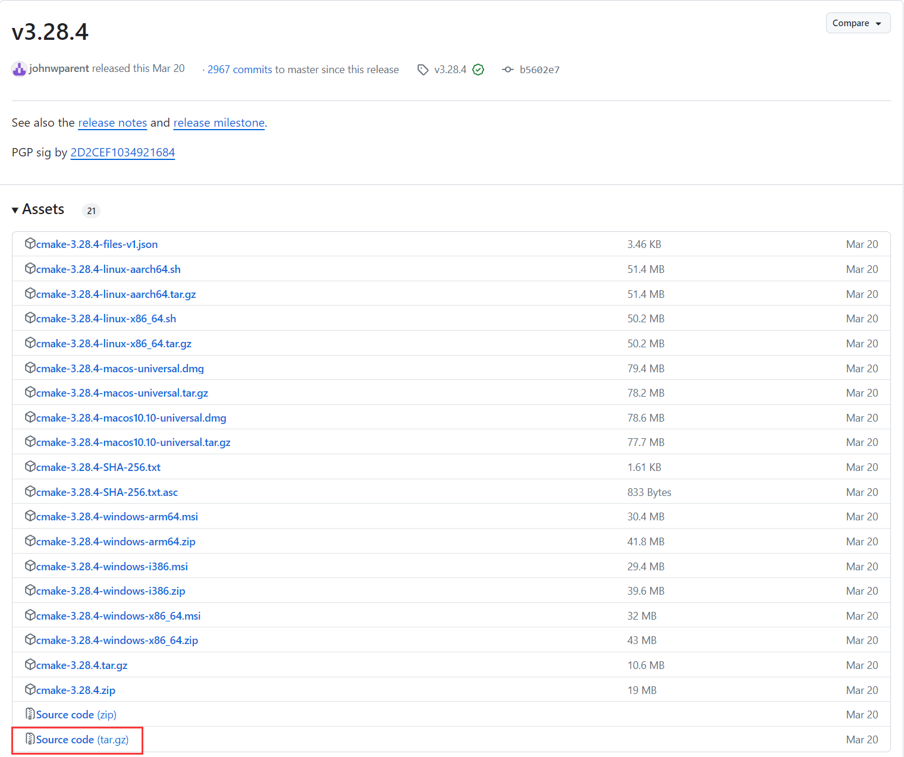

1. 下载源码 

下载地址：[https://github.com/Kitware/CMake/releases](https://github.com/Kitware/CMake/releases)，下载指定版本源码到服务器。



2. 解压压缩包

```shell
tar zxvf CMake-3.28.4.tar.gz
```

3. 编译源码

```shell
cd CMake-3.28.4/
./bootstrap
make
sudo make install
```

4. 验证安装

```shell
cmake --version
```
