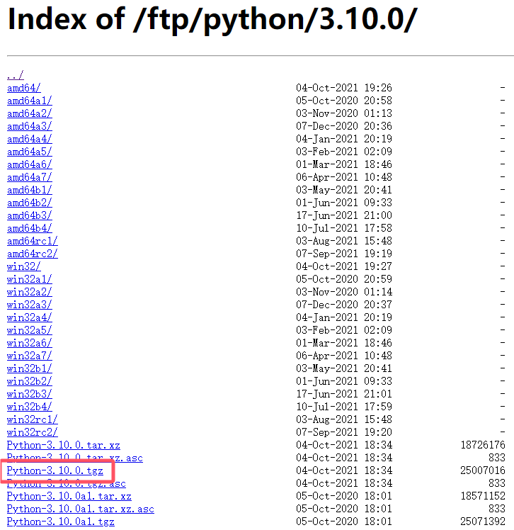

1. 下载源码 

下载地址：[https://www.python.org/ftp/python/](https://www.python.org/ftp/python/)，下载指定版本源码到服务器。



2. 解压压缩包

```shell
tar zxvf Python-3.10.0.tgz
```

3. 编译源码

```shell
cd Python-3.10.0/
./configure
make
sudo make install
```

4. 创建链接

python3默认在 `/usr/local/bin/python3` ，链接到 `/usr/bin` 目录下。

```shell
sudo ln -s /usr/local/bin/python3 /usr/bin/python3
```

5. 验证安装

```shell
python3 --version
```