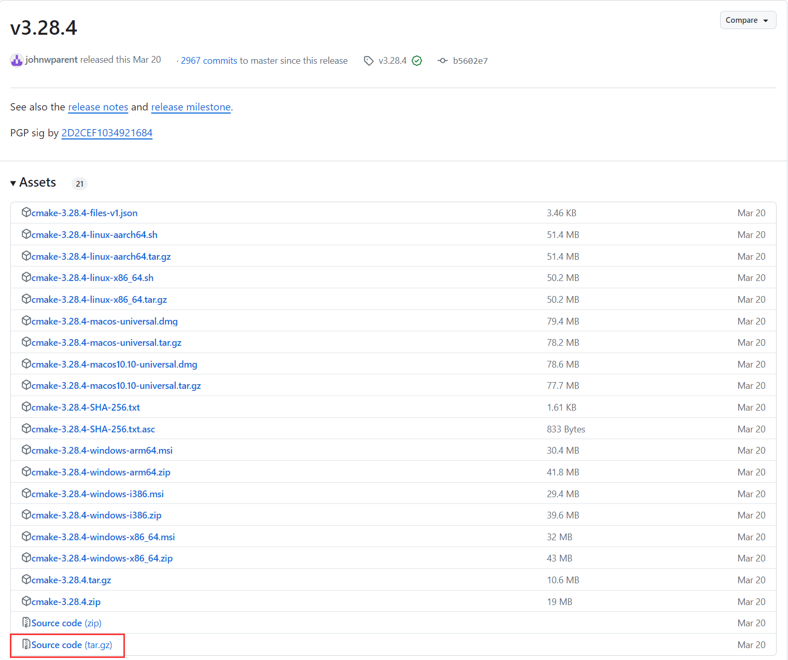
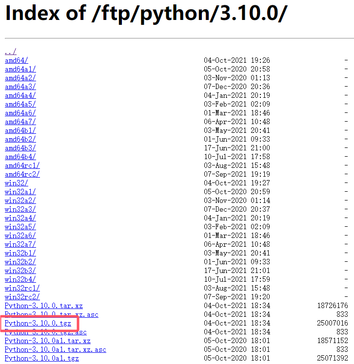
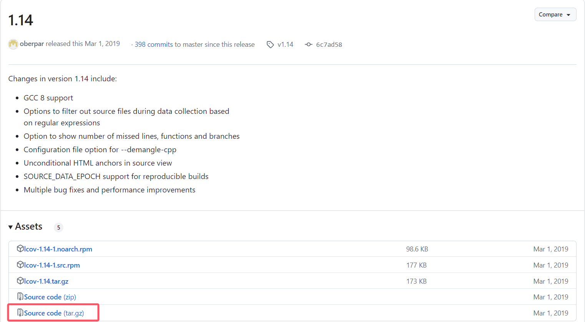

# 安装cmake

1. 下载源码 

下载地址：[https://github.com/Kitware/CMake/releases](https://github.com/Kitware/CMake/releases)，下载指定版本源码到服务器。



2. 编译

```shell
tar zxcf cmake-3.28.4.tar.gz
cd CMake-3.28.4/
./bootstrap
make
sudo make install
```

3. 验证安装

```shell
cmake --version
```

# 安装openssl

1. 安装依赖

```shell
sudo apt install build-essential checkinstall zlib1g-dev
```

2. 下载源码

下载地址：[https://www.openssl.org/source](https://www.openssl.org/source)，下载指定版本源码到服务器。

3. 编译

```shell
tar zxvf openssl-3.3.0.tgz
cd openssl-3.3.0
./config --prefix=/usr/local/ssl --openssldir=/usr/local/ssl shared zlib
make
sudo make install
```

4. 设置环境变量和库路径

```shell
echo "export PATH=/usr/local/ssl/bin:$PATH" >> ~/.bashrc
source ~/.bashrc

echo "/usr/local/ssl/lib64" | sudo tee -a /etc/ld.so.conf.d/openssl-1.1.1u.conf
```

5. 验证安装

```shell
openssl version
```

# 安装python 

1. 安装依赖

```shell
sudo apt-get install build-essential zlib1g-dev libncurses5-dev libgdbm-dev libnss3-dev libssl-dev libreadline-dev libffi-dev libsqlite3-dev wget
```

2. 下载源码 

下载地址：[https://www.python.org/ftp/python/](https://www.python.org/ftp/python/)，下载指定版本源码到服务器。



3. 编译

```shell
tar zxvf Python-3.10.0.tgz
cd Python-3.10.0/
# 临时环境变量，防止找不到openssl
export CPPFLAGS="-I/usr/local/ssl/include"
export LDFLAGS="-L/usr/local/ssl/lib"
./configure --with-openssl=/usr/local/ssl
make
sudo make altinstall
```

4. 验证安装

```shell
python3 --version
```

# 安装lcov

1. 下载源码 

下载地址：[https://github.com/linux-test-project/lcov/releases](https://github.com/linux-test-project/lcov/releases)，下载指定版本源码到服务器。



2. 编译

```shell
tar zxvf lcov-1.14.tar.gz
cd lcov-1.14/
sudo make install
```

3. 创建链接

lcov默认在 `/usr/local/bin/lcov` ，链接到 `/usr/bin` 目录下。

```shell
sudo ln -s /usr/local/bin/lcov /usr/bin/lcov
```

4. 验证安装

```shell
lcov --version
```
